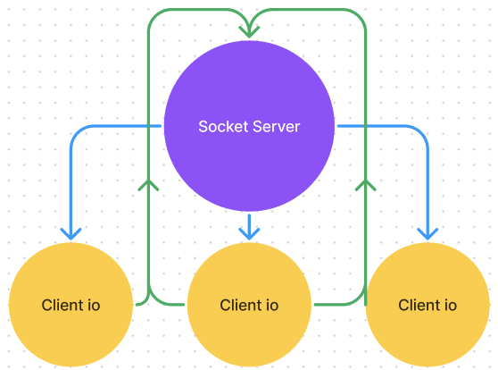
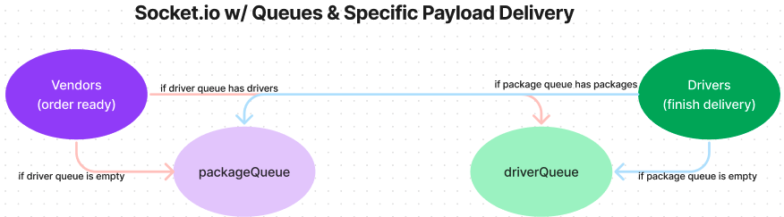

# CAPS - Code Academy Parcel Service

By: Rhett B

## UML Diagram of Architecture

## Phase 2 User Stories

- As a vendor, I want to alert the system when I have a package to be picked up.
- As a driver, I want to be notified when there is a package to be - delivered.
- As a driver, I want to alert the system when I have picked up a package and it is in transit.
- As a driver, I want to alert the system when a package has been delivered.
- As a vendor, I want to be notified when my package has been delivered.
And as developers, here is our updated story relevant to the above.

## Phase 2 Developer Stories

- As a developer, I want to create network event driven system using Socket.io so that I can write code that responds to events originating from both servers and client applications.

## UML of Vendor and Driver Queues

## Phase 3 User Stories

- As a vendor, I want to “subscribe” to “delivered” notifications so that I know when my packages are delivered.
- As a vendor, I want to “catch up” on any “delivered” notifications that I might have missed so that I can see a complete log.
- As a driver, I want to “subscribe” to “pickup” notifications so that I know what packages to deliver.
- As a driver, I want to “catch up” on any “pickup” notifications I may have missed so that I can deliver everything.
- As a driver, I want a way to “scan” a delivery so that the vendors know when a package has been delivered.

## Phase 3 Developer Stories

- As a developer, I want to create a system of tracking who is subscribing to each event.
- As a developer, I want to place all inbound messages into a “queue” so that my application knows what events are to be delivered.
- As a developer, I want to create a system for communicating when events have been delivered and received by subscribers.
- As a developer, I want to delete messages from the queue after they’ve been received by a subscriber, so that I don’t re-send them.
- As a developer, I want to create a system for allowing subscribers to retrieve all undelivered messages in their queue.